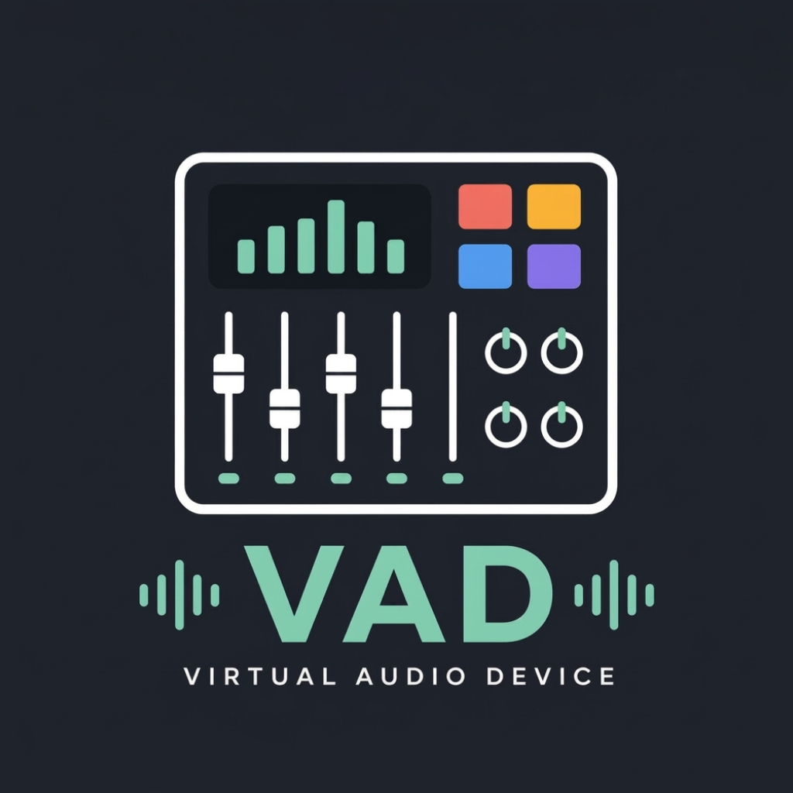

<p align="center">
  
</p>

# RodeCasterVirtualAudio

<p align="center">
  <a href="https://www.paypal.com/paypalme/alessiobrendt">
    
  </a>
</p>

A self-built macOS CoreAudio virtual audio driver plus a routing daemon, written from scratch, to replace RØDE's official virtual audio driver for the RodeCaster Pro 2 — routing macOS app audio through the RodeCaster's physical hardware faders.

## Why this exists

The RodeCaster Pro 2's official RØDE Central / virtual-audio software driver stopped working reliably on macOS — it stopped producing any audio output at all, with no fix from RØDE. Rather than wait on that, this project implements an independent, original CoreAudio HAL plug-in providing the same capability: 5 named virtual audio devices macOS apps can select as input/output, plus a background daemon that routes each one into the RodeCaster's real hardware channels, so audio actually ends up on the physical faders — not just looped back to itself.

This is **not** a kernel extension. On modern macOS, CoreAudio HAL plug-ins are a userspace mechanism: a `.driver` bundle implementing `AudioServerPlugInDriverInterface`, loaded by `coreaudiod` from `/Library/Audio/Plug-Ins/HAL/` — the same general mechanism used by well-known open-source loopback drivers (e.g. BlackHole). Nothing here is copied from any third-party driver.

**Key finding that made this possible without reverse-engineering anything:** the RodeCaster Pro 2 exposes a "Main Multitrack" USB device with 10 channels via `AppleUSBAudioEngine` — Apple's own standard USB Audio Class 2.0 driver, not a proprietary RØDE kernel driver. It's an ordinary, standard CoreAudio device any app (including this one) can write to. RØDE's own broken driver exposes 5 stereo virtual devices (5 × 2 = 10 channels) — almost certainly the same two-part pattern this project replicates.

## Architecture

Two independent pieces, both needed for the full RØDE-equivalent behavior:

1. **The HAL driver** (`src/RodeCasterVirtualAudio.c`) — exposes 5 named virtual stereo devices apps can select as input/output: `RVAD System`, `RVAD Game`, `RVAD Music`, `RVAD Virtual A`, `RVAD Virtual B` (deliberately different names/UIDs from RØDE's own devices, so both can coexist without confusion). Each device works as a loopback "virtual cable" on its own — useful even without the daemon, e.g. for routing between two apps.
2. **The routing daemon** (`daemon/rodevad-router.c`) — a separate background process (not part of the driver) that taps each of the 5 virtual devices and copies its audio into a channel pair of the real RodeCaster "Main Multitrack" hardware device, so it actually reaches the physical faders. Runs as a per-user LaunchAgent, no `sudo` required.

| Virtual device | RodeCaster Multitrack channels |
|---|---|
| RVAD System | 1–2 |
| RVAD Game | 3–4 |
| RVAD Music | 5–6 |
| RVAD Virtual A | 7–8 |
| RVAD Virtual B | 9–10 |

This channel mapping is editable at runtime via `config/channel-map.conf` (or the app's Channel Mapping tab) — it's this project's own best-effort layout, not confirmed to exactly match RØDE's original internal mapping.

## VAD — the control app

A SwiftUI app (`gui/RodeVADTester/`, builds to `VAD.app`) is the day-to-day control surface, with six tabs:

- **Dashboard** — at-a-glance status (driver installed, RodeCaster connected, all 5 devices visible, daemon running) plus a "Launch at Login" toggle.
- **Channel Test** — play a test tone into any device/channel, individually or with an Auto Test mode that cycles through every channel in sequence.
- **Levels** — live per-channel meters (peak + RMS), so you can see audio actually flowing.
- **Channel Mapping** — edit which RodeCaster channels each virtual device routes to, with a Reset to Defaults button. Changes apply on demand (restarts the daemon), never automatically.
- **Daemon** — start/stop the routing daemon, see live status and logs.
- **Restart** — restarts macOS's `coreaudiod` (reloads all audio drivers system-wide) and the daemon, for when things get stuck. This briefly interrupts all system audio and needs your admin password — gated behind a confirmation dialog.

The app never reimplements audio playback or device enumeration itself — everything shells out to the same tested CLI tools (`testtone`, the daemon) used from the command line.

## Install

Download the latest [`.pkg` installer](../../releases/latest) and double-click it. Since this isn't signed with a paid Apple Developer ID, macOS Gatekeeper will flag it as from an unidentified developer — right-click the file and choose **Open** to proceed anyway.

The installer sets up everything in one step: the driver (`/Library/Audio/Plug-Ins/HAL/`), the app (`/Applications/VAD.app`), and the routing daemon (a per-user LaunchAgent, no `sudo` needed for that part).

**Turn your system volume down before first install/run** — this is real audio hardware, and a channel-mapping mismatch or feedback loop is exactly the kind of thing you want to catch quietly, not loudly.

## Build from source

Requires only Xcode Command Line Tools (no full Xcode.app):

```
git clone https://github.com/alessiobrendt/macOS-RODE-Roadcaster-Virtual-Audio.git
cd macOS-RODE-Roadcaster-Virtual-Audio
make               # builds + verifies the driver and testtone CLI
make daemon        # builds + self-tests the routing daemon
make gui           # builds the VAD.app control surface
make installer     # builds the double-clickable .pkg
```

Manual (non-`.pkg`) install, for development:

```
./install.sh              # driver, needs sudo, prompts for confirmation
./daemon/install-daemon.sh # routing daemon, per-user LaunchAgent, no sudo
```

Verify the driver loaded:

```
system_profiler SPAudioDataType | grep -A 8 "RVAD"
```

To remove everything: `./uninstall.sh` (driver) and `./daemon/uninstall-daemon.sh` (daemon), or just delete `/Applications/VAD.app` if installed via the `.pkg`.

## Testing individual channels from the command line

```
./build/testtone --list                                    # list all CoreAudio devices
./build/testtone --device "RVAD System" --channel 1 --duration 3
```

Run `./build/testtone --help` for the full flag list.

## Known limitations

- **Ad-hoc code signing only** — no paid Apple Developer ID / notarization. Expect a Gatekeeper "unidentified developer" prompt on first install/launch; right-click → Open, or allow it in System Settings → Privacy & Security.
- **The 10-channel mapping is a best-effort guess**, not confirmed against RØDE's actual internal channel assignments. If audio comes out on unexpected RodeCaster channels, adjust it in the Channel Mapping tab or `config/channel-map.conf`.
- **No sample-rate conversion** — if the virtual devices and the Multitrack device ever end up at different sample rates, the daemon refuses to start rather than produce garbled audio, and logs a specific error.
- **No per-app volume/mute controls** on the virtual devices — they're plain loopback devices with no `AudioObjectPropertyControlList` entries.
- **No feedback-loop protection** — routing a device's audio back into whatever's also feeding it (directly, or via the RodeCaster's own mix-back) can create feedback, same as any loopback setup.
- The Restart tab is the one action that touches audio outside this project's own devices — it restarts `coreaudiod` system-wide.

## License

No license file is currently included — all rights reserved by default. Open an issue if you'd like to use this under a specific license.
